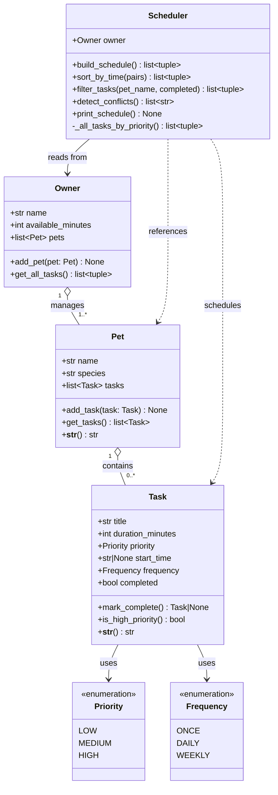

# PawPal+ — Final UML Class Diagram

## Relationships

| Relationship | Type | Description |
|---|---|---|
| `Task` → `Priority` | Association | Each task holds one Priority enum value |
| `Task` → `Frequency` | Association | Each task holds one Frequency enum value |
| `Pet` ◇── `Task` | Aggregation | Pet owns a list of Tasks; tasks can exist without a pet |
| `Owner` ◇── `Pet` | Aggregation | Owner manages a list of Pets |
| `Scheduler` → `Owner` | Dependency | Scheduler reads owner data to build a plan |
| `Scheduler` ··> `Task`/`Pet` | Usage | Scheduler returns (Pet, Task) pairs but does not own them |

## Changes from initial design

| Initial | Final | Reason |
|---|---|---|
| `DailyPlan` class | Removed | Replaced by `list[tuple[Pet, Task]]` — simpler, no extra wrapper needed |
| `Task` had no `start_time` | Added `start_time: str\|None` | Required for time-based sorting and conflict detection |
| `Task` had no `frequency` | Added `frequency: Frequency` | Required for recurring task logic |
| `mark_complete()` returned `None` | Returns `Task\|None` | Caller receives the next occurrence for recurring tasks |
| `Owner` had `add_task()` | Removed | Tasks belong to Pets, not directly to Owner |
| `Scheduler` took `(owner, pet, tasks)` | Takes only `owner` | Owner already holds all pets and tasks — simpler API |
